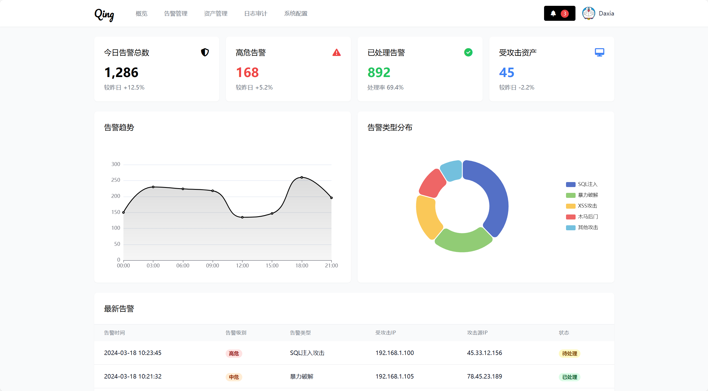
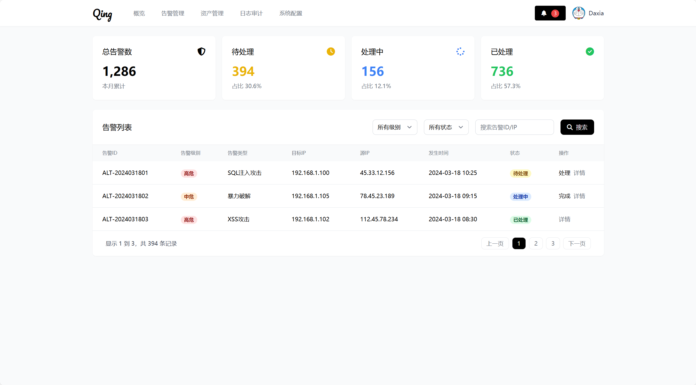
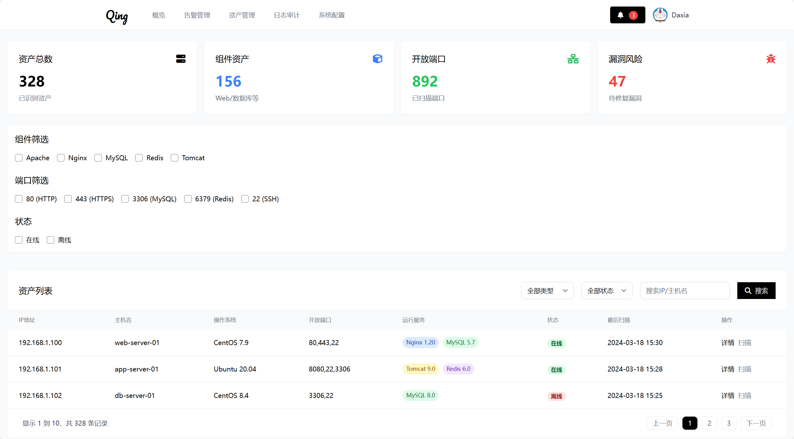
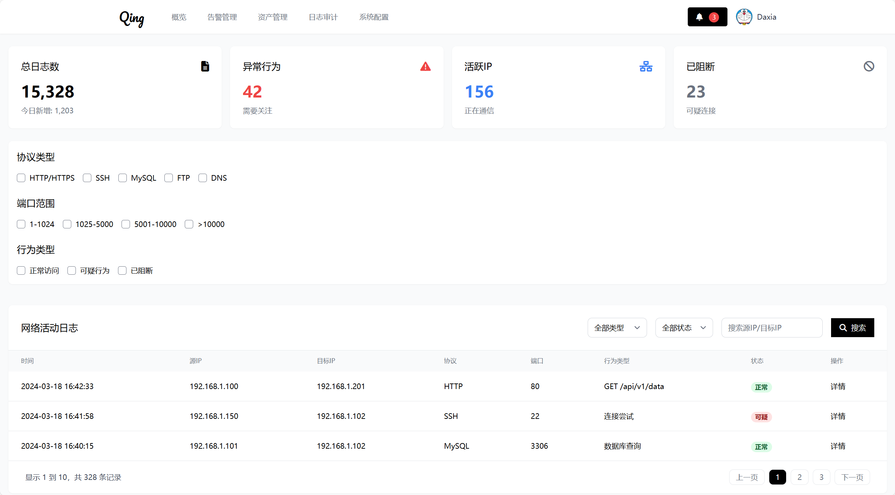
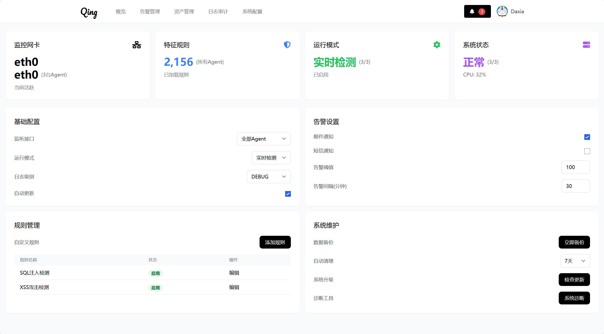

 

Qing NIDS 是一款高性能、易扩展的开源网络入侵检测系统，旨在帮助企业和个人用户有效监控和防御网络攻击。Qing NIDS 采用先进的检测算法，能够实时分析网络流量，识别潜在的安全威胁，并提供详细的告警信息。

### 主要特点
- **实时监控**：实时监控网络流量，快速发现异常行为。
- **高精度检测**：采用多种检测算法，提高检测准确率。
- **灵活配置**：支持自定义规则和策略，满足不同场景需求。
- **易用界面**：提供友好的用户界面，方便管理和操作。
- **扩展性强**：支持插件扩展，可根据需求添加新的功能模块。

## 告警中心

告警中心是 Qing NIDS 的核心模块之一，负责收集和展示所有检测到的安全事件。告警中心提供了以下功能：

- **实时告警**：实时显示当前检测到的安全事件，包括时间、来源、目标、事件类型等详细信息。
- **告警分类**：根据事件类型对告警进行分类，便于用户快速定位和处理。
- **告警历史**：记录历史告警信息，支持按时间、类型等条件查询。
- **告警通知**：支持通过邮件、短信等方式将告警信息发送给指定的管理员。

## 资产中心

资产中心用于管理网络中的各类资产，包括服务器、终端设备、网络设备等。资产中心提供了以下功能：

- **资产清单**：列出所有已知的网络资产，包括IP地址、MAC地址、操作系统等信息。
- **资产分类**：支持按类型、位置等条件对资产进行分类管理。
- **资产状态**：显示资产的在线状态、健康状况等信息。
- **资产配置**：支持对资产进行配置管理，如设置安全策略、更新软件等。

## 审计中心

审计中心负责记录和分析系统的各项操作日志，确保系统的安全性和合规性。审计中心提供了以下功能：

- **操作日志**：记录用户的登录、操作等行为，支持按时间、用户等条件查询。
- **审计报告**：生成详细的审计报告，包括操作统计、异常行为分析等。
- **合规检查**：支持对系统进行合规性检查，确保符合相关法规和标准。

## 系统配置

系统配置模块允许用户对 Qing NIDS 进行全局配置，以满足不同的使用需求。系统配置提供了以下功能：

- **基本设置**：配置系统的运行参数，如监听端口、日志路径等。
- **检测规则**：管理检测规则，支持自定义规则和导入预设规则。
- **告警设置**：配置告警通知的方式和接收人。
- **用户管理**：管理系统的用户账号，包括添加、删除、权限分配等。
- **系统升级**：支持在线升级系统，确保使用最新版本的功能和修复。

### 联系我们

- **Email**: 78778443@qq.com
